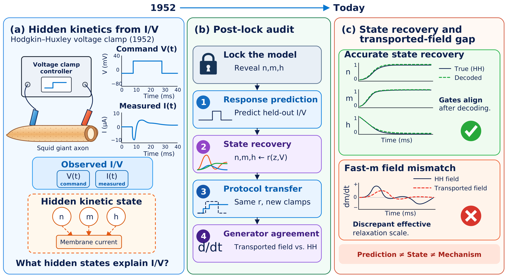
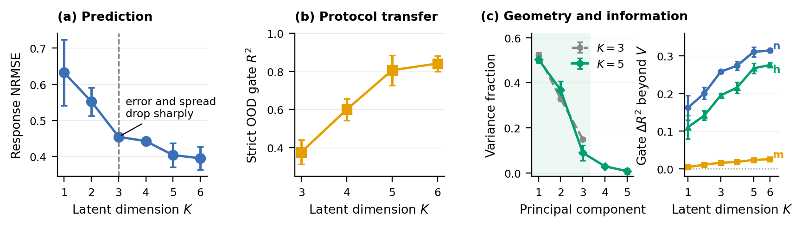
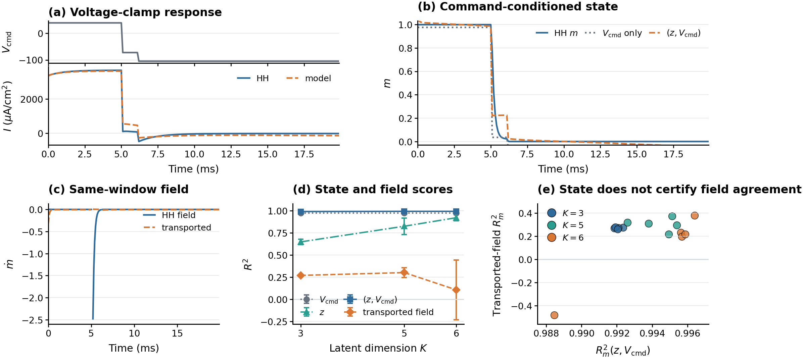
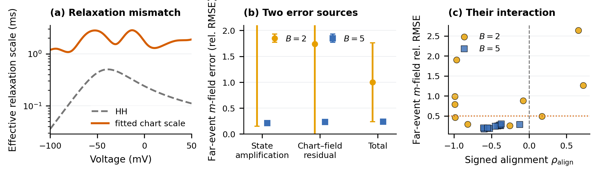

# HH Self-Discovery

**Retracing Hodgkin and Huxley: State Recovery Does Not Certify Mechanism**

Peiyu Zang · Jiayi Hao · Yongqiang Cai — School of Mathematical Sciences, Beijing Normal University

Predicting observed dynamics does not establish recovery of the underlying physical
mechanism. This repository trains structured latent models on simulated current and
voltage from the Hodgkin–Huxley (HH) model and then asks what those models actually
recovered.

A **truth firewall** splits each experiment in half. Gate trajectories (`n`, `m`, `h`)
and the analytic HH generator are excluded from training, validation, checkpoint
selection, and latent-dimension selection, so the learner sees only the observable
current `I(t)` and voltage `V(t)`. Gates and equations are opened only after a model is
locked, for four increasingly strict audits.



## The four post-lock tests

| # | Test | Question |
|:--|:-----|:---------|
| 1 | **Response prediction** | Does the model reproduce held-out current and voltage? |
| 2 | **State recovery** | Can a post-lock chart decode `n`, `m`, `h` from the latent state? |
| 3 | **Protocol transfer** | Does the same chart survive stimulation families withheld in their entirety? |
| 4 | **Generator agreement** | Does the transported latent field agree with the HH equations through that chart? |

The tests are graded in that order, and passing an earlier one does not imply passing a
later one.

## Results

### Three latent dimensions

Prediction error and its cross-seed spread both drop sharply at three latent dimensions
under the tested protocols, while gate recovery under new protocols keeps improving
through five to six coordinates. Latent variance stays concentrated in three principal
directions, so the additional coordinates buy transfer rather than capacity.



### State decoding is not dynamics recovery

Voltage clamp supplies a clean paired test: the command `V_cmd` is an external
intervention rather than a predicted response, so state and field can be scored on the
identical points with the identical chart.

| Latent dim. `K` | `m`-state R² from `V_cmd` | `m`-state R² from `(z, V_cmd)` | transported-field R² |
|:--:|:--:|:--:|:--:|
| 3 | 0.976 | **0.992** | 0.271 |
| 5 | 0.976 | **0.994** | 0.303 |
| 6 | 0.976 | **0.994** | 0.109 |

Five seeds, identical 39,616 held-out smooth voltage-clamp points. Adding the latent
state to the command lifts `m`-state decoding above 0.99 and reduces the residual mean
squared error by 67–77% relative to the command alone — while the transported field on
those same points stays far from the HH generator. Field agreement does not improve with
latent dimension either: `K = 6` has the best state scores and the worst field score.



Known invertible HH coordinates attain field R² of 0.995 (affine) and 0.970 (nonlinear)
under the same audit procedure, so the audit itself admits high field agreement.

### Where the gap comes from

An exact HH identity decomposes the transported-field error into a time-scale-weighted
state error and a residual between the transported dynamics and the HH equations at the
decoded state. The two terms can cancel or reinforce, which is how similar state scores
can sit next to very different errors in dynamics.



## Repository layout

- `src/hh_self_discovery/`: simulator, protocols, datasets, models, training, and audits.
- `scripts/`: data generation, training, evaluation, robustness controls, and audits.
- `configs/`: experiment configurations.
- `tests/`: unit and integration tests for simulation, data isolation, models, and evaluation.
- `results/`: aggregate machine-readable outputs for the reported audits.
- `external/`: upstream baseline repositories, fetched by `scripts/fetch_baselines.sh`.
- `external_patches/`: compatibility patches applied to upstream baselines.

Large generated datasets and checkpoints are intentionally excluded from Git.

## Installation

```bash
git clone https://github.com/factnn/hh-self-discovery.git
cd hh-self-discovery
python -m venv .venv
source .venv/bin/activate
pip install -e .
bash scripts/fetch_baselines.sh
```

The last step clones the upstream baseline implementations into `external/` and prints
the compatibility patch command for the DDAE baseline.

## Validation and reproduction

```bash
python -m pytest
PYTHONPATH=src python scripts/smoke_simulation.py
CUDA_VISIBLE_DEVICES=0 bash scripts/reproduce_final.sh
```

`scripts/reproduce_final.sh` generates missing data, trains the locked model family, and
runs the observable, OOD, and post-lock audits. GPU selection is controlled through
`CUDA_VISIBLE_DEVICES`; no physical device index is assumed by the code.

## Citation

```bibtex
@misc{zang2026retracing,
  title  = {Retracing Hodgkin and Huxley: State Recovery Does Not Certify Mechanism},
  author = {Zang, Peiyu and Hao, Jiayi and Cai, Yongqiang},
  year   = {2026},
  note   = {Preprint}
}
```

## License

MIT. See `LICENSE`.
